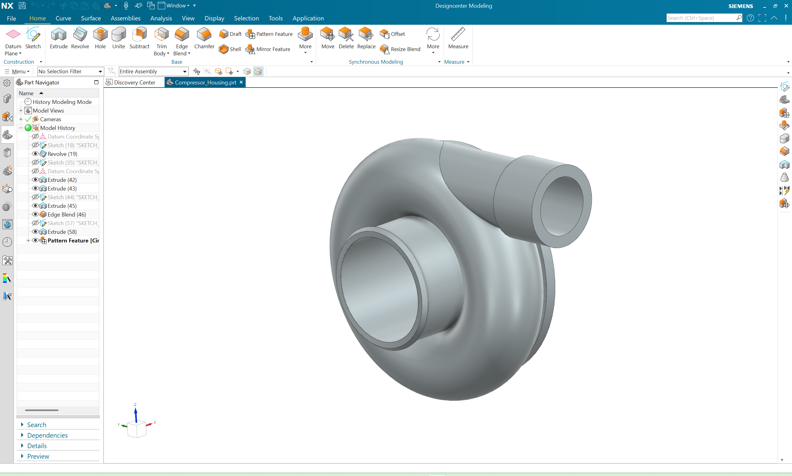
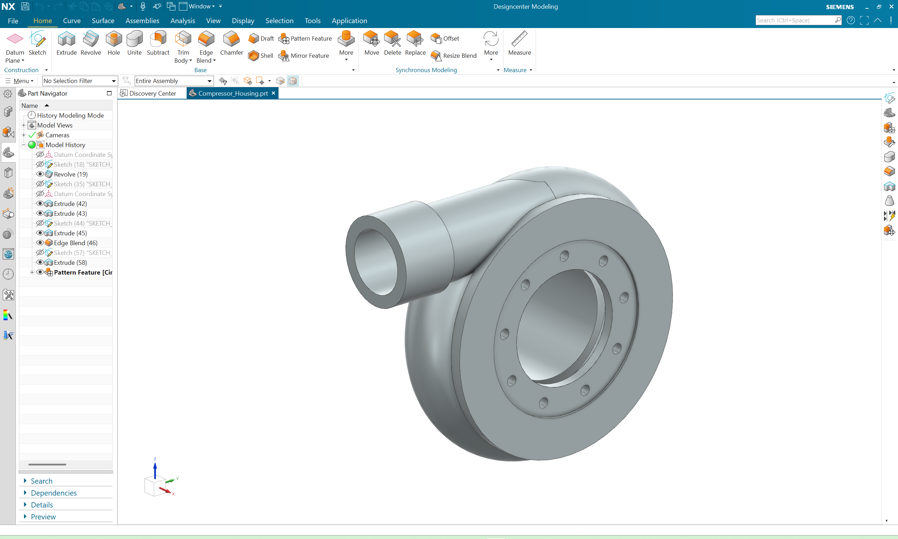
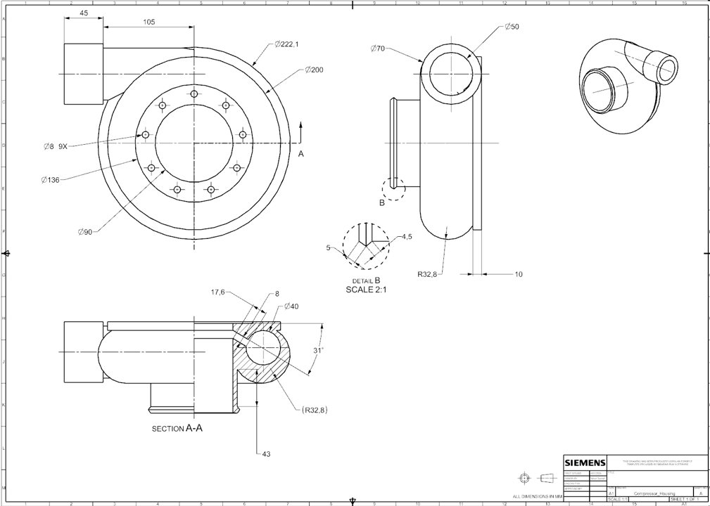
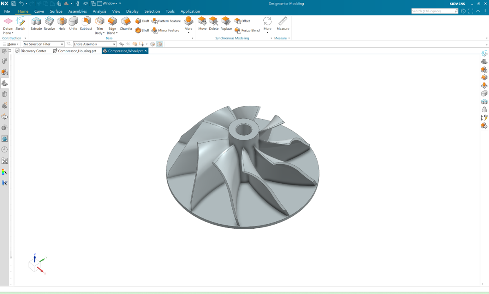
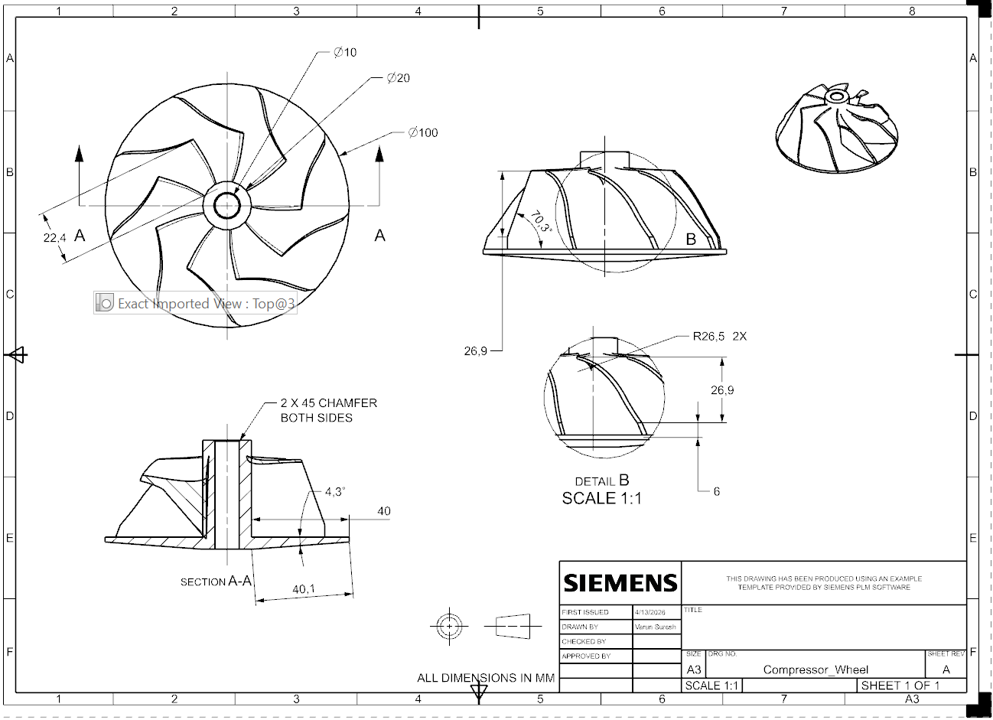

- **Compressor Housing**: intake-side volute enclosing the compressor wheel and directing pressurized air to the outlet




> Technical Documentation


---

- **Compressor Wheel**: driven impeller pressurizing intake air before delivery to the engine combustion chamber



> Technical Documentation


---

- **Center Bearing Housing**: structural core enclosing the shaft bearings and oil galleries, linking turbine and compressor housings


> Technical Documentation


---

- **Shaft**: precision-ground rotating shaft linking the turbine and compressor wheels through the bearing housing


> Technical Documentation


---

- **Turbine Wheel**: high-speed rotor extracting energy from exhaust gas flow to drive the compressor shaft


> Technical Documentation


---

- **Turbine Housing**: exhaust-side volute directing hot gas flow onto the turbine wheel at optimal incidence angle


> Technical Documentation

```
